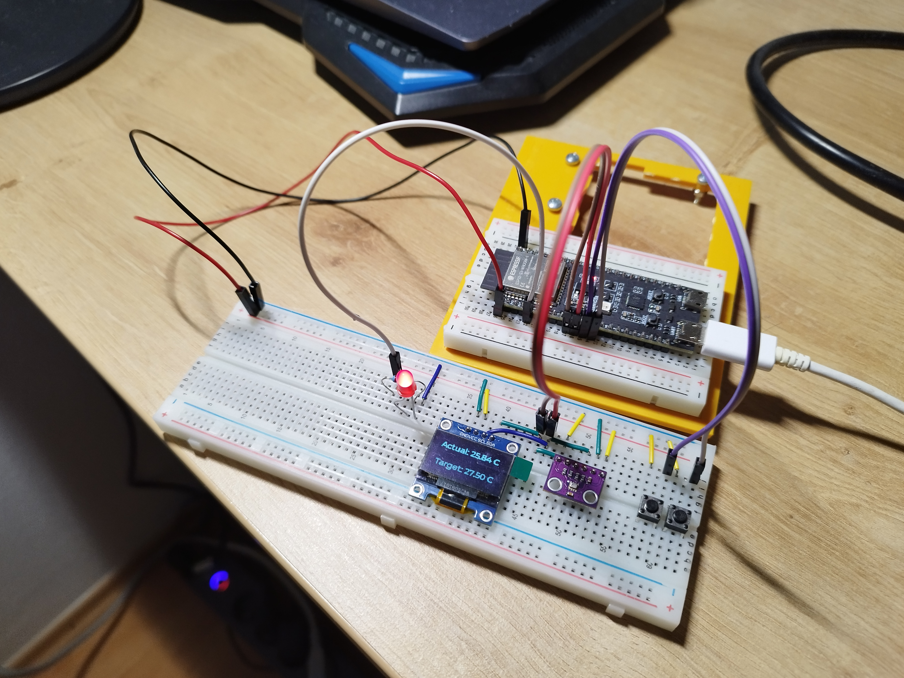
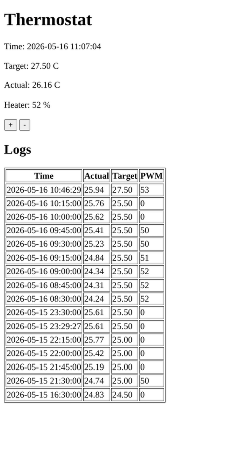

# Smart Thermostat with ESP32-S3

A sophisticated IoT-enabled smart thermostat built on ESP32-S3 with temperature sensing, local OLED display, push-button controls, and a web-based interface for remote temperature management.

## 📋 Table of Contents

- [Overview](#overview)
- [Hardware Setup](#hardware-setup)
- [Web Interface](#web-interface)
- [Components](#components)
- [Hardware Wiring](#hardware-wiring)
- [Features](#features)
- [Software Architecture](#software-architecture)
- [Build & Flash](#build--flash)
- [License](#license)
- [Support](#support)

---

## 🎯 Overview

This project implements a fully functional smart thermostat system featuring:

- **Real-time temperature monitoring** using a BMP280 sensor
- **Local control interface** via 128x64 OLED display with push buttons
- **Remote control** through an intuitive web UI
- **Intelligent heating control** using PID algorithm for precise temperature regulation
- **Persistent storage** of target temperature settings and logging of temperature data
- **WiFi connectivity** for remote access

## 🛠️ Hardware Setup


## 🌐 Web Interface


---

## 🔧 Components

### Microcontroller
- **ESP32-S3** - Main processor with integrated WiFi/Bluetooth
  - 2.4GHz WiFi support
  - 240 MHz dual-core processor
  - 512KB SRAM, Flash storage

### Sensors
- **BMP280** - Environmental sensor
  - Temperature sensing (±1°C accuracy)
  - Pressure measurement
  - I2C Interface
  - Address: 0x76 (SDO pin tied to GND)

### Display
- **SSD1306** - 128x64 OLED Display
  - Monochrome display
  - I2C Interface
  - Address: 0x3C
  - Resolution: 128×64 pixels
  - Real-time temperature display with LVGL UI

### Input Controls
- **Push Button UP** - Increase target temperature
  - GPIO Pin: 3
  - Debouncing enabled (20ms)

- **Push Button DOWN** - Decrease target temperature
  - GPIO Pin: 8
  - Debouncing enabled (20ms)

### Heating System
- **PWM Heater Output** - PWM-controlled heating element
  - GPIO Pin: 5
  - Frequency: 5 kHz
  - Resolution: 10-bit (0-1023)

---

## 🔌 Hardware Wiring

### Pin Configuration Summary
```
ESP32-S3 Pin Layout
═══════════════════════════════════════════════════════

GPIO 3    ──────────► Button UP (Active Low), using internal pull-up
GPIO 5    ──────────► Heater PWM Output
GPIO 8    ──────────► Button DOWN (Active Low), using internal pull-up
GPIO 17   ──────────► I2C SDA (BMP280 + SSD1306)
GPIO 18   ──────────► I2C SCL (BMP280 + SSD1306)
GND       ──────────► BMP280 SDO (Set address to 0x76)
```

### I2C Bus Configuration
Both sensors share the same I2C bus:

| Component | I2C Role | GPIO | Function |
|-----------|----------|------|----------|
| ESP32-S3  | Master   | GPIO 17 | SDA (Data) |
| ESP32-S3  | Master   | GPIO 18 | SCL (Clock) |
| BMP280    | Slave    | -    | Address: 0x76 |
| SSD1306   | Slave    | -    | Address: 0x3C |

---

## ✨ Features

### Hardware Features
- Real-time temperature monitoring (±1°C accuracy)
- Local OLED display with live temperature updates
- Physical push buttons for local control
- PWM-based heating element control
- Debounced button inputs (20ms)
- Precise temperature target control (0.5°C increments)

### Software Features
- PID control algorithm for stable heating
  - Kp = 2.0, Ki = 0.5, Kd = 1.0
- Target temperature range: 0-40°C
- Persistent storage of temperature settings
- WiFi connectivity
- Web-based remote interface
- Real-time monitoring dashboard

### Display Features
- LVGL GUI framework
- 128×64 pixel resolution

---

## 🏗️ Software Architecture

### Component Structure
```
components/
├── thermostat/        # Temperature control & BMP280 sensor
│   ├── thermostat.c
│   ├── buttons.c
│   └── include/
├── display/           # SSD1306 OLED display driver
│   ├── display.c
│   └── include/
├── web_server/        # WiFi setup & HTTP server
│   ├── web_server.c
│   ├── wifi.c
│   ├── app.js
│   ├── index.html
│   └── include/
├── storage/           # Non-volatile settings
│   ├── storage.c
│   └── include/
├── my_time/           # Time management
│   └── include/
└── CMakeLists.txt
```

---

## 📝 Build & Flash

### Prerequisites
- ESP-IDF v6.0.1 or later
- ESP32-S3 development board
- USB cable for programming
- Configure your WiFi credentials in [components/storage/include/wifi_credentials.h](components/storage/include/wifi_credentials.h)

### Setup and Build

First, source the ESP-IDF environment:
```bash
source "/path/to/.espressif/tools/activate_idf_v6.0.1.sh"
```

Set the target device and build/flash/monitor in one command:
```bash
idf.py set-target esp32s3
idf.py build flash monitor
```

To open the web UI, watch the IP address printed in `idf.py monitor`, then enter that IP in your browser.

---

## 🔒 License

See [LICENSE](LICENSE) file for details.

---

## 📞 Support

For issues, questions, or contributions, please refer to the project repository.
